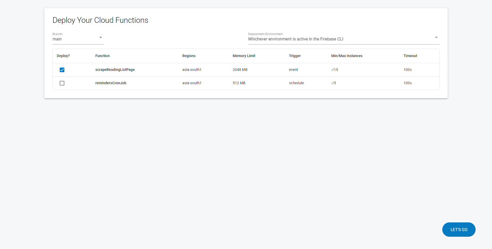

# Firebase Cloud Functions Deployer

A useful GUI to help you list your Firebase Cloud Functions, their configurations and deploy them when working locally.

Install it to your Cloud Functions directory by:

```bash
npm i --save-dev fcf-deployer@latest
```

Then run it using:

```bash
npx open-functions-deployer
```

And open the URL that is shown in the terminal after running this command.



## What it can do

- Deploy Firebase Cloud Functions and view real-time deployment logs in your browser.
- Change Git branches from the UI to seamlessly run point-in-time Cloud Function deployments.
- Deploy Cloud Functions for a specific environment/project (Useful for people running multiple Firebase Cloud Functions from a single codebase - For use cases such as staging and production).


## Possible Configs

The tool supports configuration in two ways:

- Via the CLI
- Via a Config File `fcf-deployer.config.json` that can be created in the functions directory.

| Property            | Description                                                                                                                         | Required                       | Default Value    |
| ------------------- | ----------------------------------------------------------------------------------------------------------------------------------- | ------------------------------ | ---------------- |
| functionsEntrypoint | The file that containst the exports for all your cloud functions. See below what you need to do for functions written in Typescript | No (Yes in case of TypeScript) | `./functions.js` |
| firebasercFile      | The path to `./firebaserc` file if any                                                                                              | No                             | `../.firebaserc` |
| prerunScript        | Script to run before the GUI is started                                                                                             | No                             | `''`             |
| port                | The localhost port on which to run the GUI                                                                                          | No                             | `10444`          |

Via the CLI:

```bash
npx open-functions-deployer  -- --functionsEntrypoint=./index.js --firebasercFile=./.firebaserc
```

Via the Config File:

```json
// fcf-deployer.config.json
{
	"port": 3456,
	"functionsEntryPoint": "./lib/index.js",
	"firebasercFile": "./.firebaserc",
	"prerunScript": "node scripts/prepare-functions"
}
```

## FAQs

#### I'm using TypeScript, anything I need to do?

This tool automatically compiles your functions at start-time so you don't need to worry about it.

You just have to specify the path of the function's file, in most cases it would be `./lib/index.js`.

#### I need to set some environment variables or run something before I deploy my Cloud Functions. How do I do that?

So in this case you have two options:

- Use the `predeploy` config in your `firebase.json`'s `functions` property.
- Use the `prerunScript` property to specify a command that you want to run at the start time, this would ensure what you need before your Firebase Cloud Functions deploy are run.
